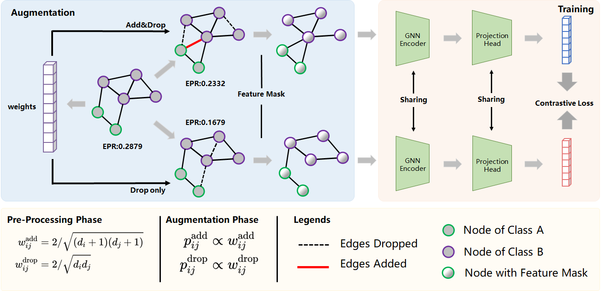

# Why Does Dropping Edges Usually Outperform Adding Edges in Graph Contrastive Learning? (AAAI 2025)

This is our PyTorch implementation of EPAGCL:

>   Yanchen Xu$^+$, Siqi Huang$^+$, Hongyuan Zhang$^*$, and Xuelong Li$^*$, "Why Does Dropping Edges Usually Outperform Adding Edges in Graph Contrastive Learning?", in Proceedings of the AAAI Conference on Artificial Intelligence (AAAI), 2025. ([arXiv](https://arxiv.org/pdf/2412.08128.pdf))




The main script is `main.py` used for training on various datasets and evaluating periodically during training. Evaluation is triggered every `args.eval` epochs and will not back-propagate any gradient to the encoder.

## Requirements 
This code package was developed and tested with Python 3.11.7. The required dependencies are as follows:

- numpy 1.26.4
- ogb 1.3.6
- scipy 1.11.4
- thop 0.1.1.post2209072238
- torch 2.3.0
- torch_geometric 2.5.3
- tqdm 4.65.0

## How to run

To run EPAGCL:
```
python main.py --add_single
```

To run EPAGCL that **computes loss in batch** to reduce memory burden (batch size = 256 in defalut and can be changed in line 21 of `Model.py`):
```
python main.py --add_single --batch_compute
```

To compute EPR of certain dataset (set in line 8 of `EPR.py`):
```
python EPR.py
```

To conduct Wilcoxon signed-rank test (set accuracy in line 2 and line 3 of `wilcoxon.py`):
```
python wilcoxon.py
```

## Hyper-parameters

Hyper-parameters used for each dataset is listed in the appendix of our paper. To run EPAGCL with different setting, one may change the corresponding variables in `Arguments.py` or set them through command line.

For example, to run EPAGCL on ogbn-arxiv:
```
python main.py --add_single --dataset ogbn-arxiv --edge_drop_rate_1 0.6 --edge_drop_rate_2 0.6 --batch_compute
```
All hyper-parameters set through `Arguments.py` will be printed in `args.txt`.

## Ablation Settings

There are some options as follows for ablation study:
- --add_single: add edges for only one view.
- --not_add_edge: not add edges for generating views.
- --not_drop_edge: not drop edges for generating views.
- --add_edge_random: add edges randomly for generating views.

These settings will be printed in `result.txt` for ease of viewing.

## Citation

If you find the code useful for your research, please consider citing our work:
```
@inproceedings{EPAGCL,
  author={Xu, Yanchen and Huang, Siqi and Zhang, Hongyuan and Li, Xuelong},
  booktitle={Proceedings of the AAAI Conference on Artificial Intelligence (AAAI)},
  title={Why Does Dropping Edges Usually Outperform Adding Edges in Graph Contrastive Learning?}, 
  year={2025},
  pages={},
}
```
